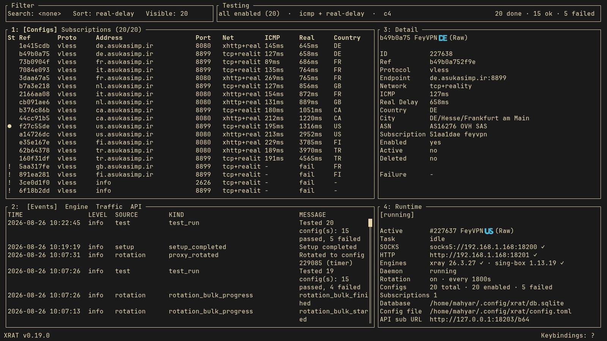

<p align="center">
  
</p>

<h1 align="center">XRAT - Xray-core and sing-box Proxy Manager</h1>

<p align="center">
  <em>A Rust CLI and TUI proxy configuration manager for <a href="https://github.com/xtls/xray-core">XTLS/Xray-core</a>, <a href="https://github.com/v2fly/v2ray-core">V2Ray-core</a>, and <a href="https://github.com/sagernet/sing-box">SagerNet/sing-box</a></em>
</p>

<p align="center">
  
  
  
  <a href="https://mhyrzt.github.io/xrat"></a>
  <a href="https://crates.io/crates/xrat"></a>
</p>

XRAT is an open-source Rust proxy manager for importing, storing, testing,
ranking, rotating, and running proxy configurations from the terminal. It works
with [XTLS/Xray-core](https://github.com/xtls/xray-core),
[V2Ray-core](https://github.com/v2fly/v2ray-core), and
[SagerNet/sing-box](https://github.com/sagernet/sing-box), with support for
VLESS, VMess, Trojan, Shadowsocks, SOCKS5, HTTP, and Hysteria2 workflows.

Use xrat to manage subscription links, test proxy latency, scan Cloudflare/CDN
edge IPs, run managed local SOCKS/HTTP/Shadowsocks inbounds, supervise runtime
sessions with a daemon, and serve stored configs through a local HTTP API.

<p align="center">
  
</p>

## Installation

Install script (Linux/macOS):

```bash
curl -fsSL https://raw.githubusercontent.com/mhyrzt/xrat/master/install.sh | bash
```

Or with Cargo from [crates.io](https://crates.io/crates/xrat):

```bash
cargo install xrat
xrat setup
alias xratui="xrat tui"   # optional: shortcut to launch the TUI
```

Requires `xray` on your system. `cargo install` only places the binary; run
`xrat setup` to finish setup (init, daemon, completions, man pages, desktop).
For other installation methods (manual binary download, Docker, build from
source) see the
[installation docs](https://mhyrzt.github.io/xrat/01-getting-started/installation.html).

## Current Features

- **Import** subscriptions, files, raw links, base64 lists, SIP008 JSON, and
  Xray JSON into SQLite or PostgreSQL.
- **Support** VLESS, VMess, Trojan, Shadowsocks, HTTP, SOCKS5, and Hysteria2
  parsing/preview.
- **Deduplicate** configs with normalized, versioned keys while preserving
  subscription metadata.
- **Test** proxies with ICMP, TCP, real-delay, download, and upload stages.
- **Rank** bulk test results with concurrency control, failure classification,
  history, and GeoIP enrichment.
- **Run** stored configs as managed Xray-core or V2Ray-core local proxy
  sessions.
- **Expose** SOCKS5, HTTP, and Shadowsocks inbounds with configurable ports and
  sniffing.
- **Supervise** runtime sessions through a daemon with IPC, health checks, and
  stale-session reattach.
- **Rotate** proxies automatically on schedule or health failure, with cooldown
  and manual override.
- **Scan** Cloudflare/CDN edge IPs and persist reachable endpoints with latency.
- **Control** configs through CLI, interactive TUI, HTTP API, or systemd user
  services.
- **Serve** stored configs as JSON or base64 subscriptions with optional API-key
  authentication.
- **Manage** config state with enable, disable, soft delete, restore, purge, and
  detailed show commands.
- **Inspect** operational events with `xrat logs` for daemon, runtime, rotation,
  health, and test activity.
- **Generate** shell completions, man pages, Docker images, and self-upgrade
  from releases or source.

## Acknowledgments

Some functionalities in XRAT have been inspired by
[xray-knife](https://github.com/lilendian0x00/xray-knife).
