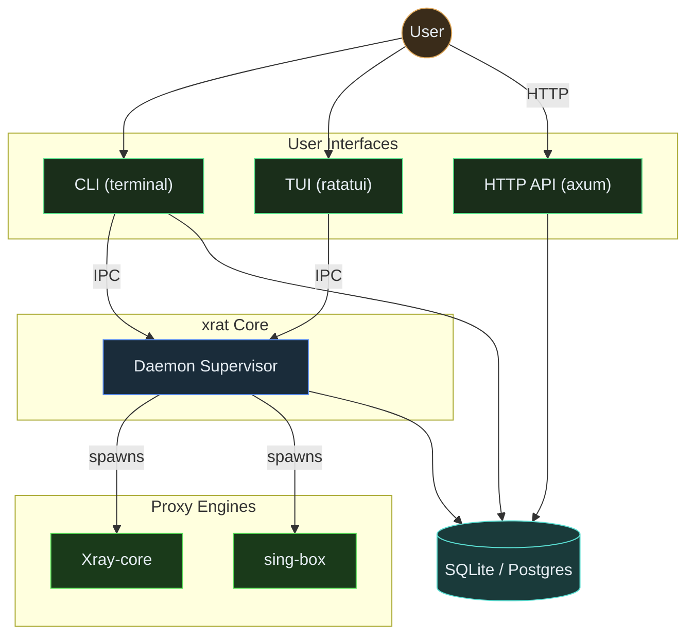

# Architecture

This section describes xrat's internal architecture, data flow, and module
structure for developers and contributors.

## Context Diagram

## Pages

| Page                                                  | Description                                             |
| ----------------------------------------------------- | ------------------------------------------------------- |
| [Module Structure](module-structure.md)               | Source tree, module responsibilities, dependency graph  |
| [Config Generation](config-generation.md)             | How engine JSON configs are generated from nodes        |
| [Import Pipeline](import-pipeline.md)                 | End-to-end subscription import flow                     |
| [Daemon Architecture](daemon-architecture.md)         | Daemon process, IPC protocol, supervisor event loop     |
| [Runtime Lifecycle](runtime-lifecycle.md)             | Session state machine, connect/replace/disconnect flows |
| [Test Pipeline](test-pipeline.md)                     | Probe execution, test stages, output formatting         |
| [Database Schema](../05-reference/database-schema.md) | Full SQL DDL and per-table column reference             |
