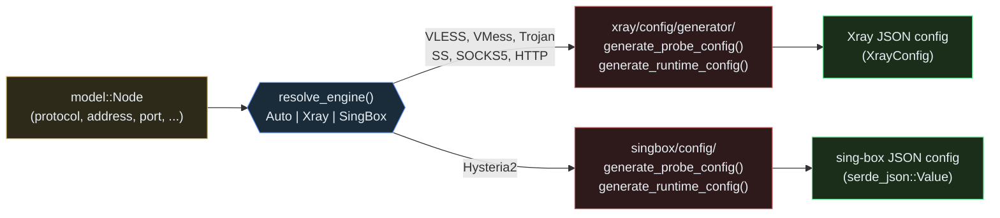

# Config Generation

xrat generates runtime configuration JSON from normalized `Node` objects for
both Xray-core and sing-box engines.

## Overview

The config generation pipeline:

1. **Node** (domain model) → Protocol-specific mapping → JSON config
2. Supports probe configs (short-lived, for testing) and runtime configs
   (long-lived)



## Xray Config Generation

Located in `src/xray/config/`.

### Entry Points

```rust
// Probe config (used for testing)
pub fn generate_probe_config(node: &Node, local_port: u16) -> Result<XrayConfig, String>

// Runtime config (used for connect)
pub fn generate_runtime_config(node: &Node, socks_port: u16, http_port: Option<u16>) -> Result<XrayConfig, String>

// Runtime config with custom inbound hosts
pub fn generate_runtime_config_with_inbounds(
    node: &Node,
    socks_host: &str,
    socks_port: u16,
    http_host: Option<&str>,
    http_port: Option<u16>,
) -> Result<XrayConfig, String>

// Runtime config with fully configurable inbounds
pub fn generate_runtime_config_for_inbounds(
    node: &Node,
    socks: Option<(&str, u16, bool)>,
    http: Option<(&str, u16)>,
) -> Result<XrayConfig, String>
```

### Probe Config

Used by the testing pipeline to measure real-delay latency:

```json
{
  "log": { "loglevel": "warning" },
  "inbounds": [
    {
      "tag": "probe-in",
      "port": <random>,
      "listen": "127.0.0.1",
      "protocol": "socks",
      "settings": { "udp": false }
    }
  ],
  "outbounds": [
    {
      "tag": "proxy",
      "protocol": "<node.protocol>",
      "settings": { ... },
      "stream_settings": { ... }
    }
  ]
}
```

### Runtime Config

Used by the managed proxy session:

```json
{
  "log": { "loglevel": "warning" },
  "inbounds": [
    {
      "tag": "socks-in",
      "port": 1080,
      "listen": "0.0.0.0",
      "protocol": "socks",
      "settings": { "udp": true }
    },
    {
      "tag": "http-in",
      "port": 8080,
      "listen": "0.0.0.0",
      "protocol": "http"
    }
  ],
  "outbounds": [
    {
      "tag": "proxy",
      "protocol": "<node.protocol>",
      "settings": { ... },
      "stream_settings": { ... }
    }
  ]
}
```

### XrayConfig Struct

```rust
#[derive(Debug, Clone, Serialize, Deserialize)]
pub struct XrayConfig {
    pub log: LogConfig,
    pub inbounds: Vec<Inbound>,
    pub outbounds: Vec<Outbound>,
}
```

### Outbound Generation

Each protocol maps to a specific outbound format:

#### VLESS

When the link carries a `flow` extension (e.g. `xtls-rprx-vision`), it is added
to the user entry:

```json
{
  "vnext": [
    {
      "address": "example.com",
      "port": 443,
      "users": [
        {
          "id": "uuid-123",
          "encryption": "none",
          "flow": "xtls-rprx-vision"
        }
      ]
    }
  ]
}
```

#### VMess

```json
{
  "vnext": [
    {
      "address": "example.com",
      "port": 443,
      "users": [
        {
          "id": "uuid-456",
          "alterId": 0,
          "security": "auto"
        }
      ]
    }
  ]
}
```

#### Trojan

```json
{
  "servers": [
    {
      "address": "example.com",
      "port": 443,
      "password": "password"
    }
  ]
}
```

#### Shadowsocks

```json
{
  "servers": [
    {
      "address": "example.com",
      "port": 8388,
      "method": "aes-256-gcm",
      "password": "secret"
    }
  ]
}
```

#### SOCKS5

```json
{
  "servers": [
    {
      "address": "example.com",
      "port": 1080,
      "users": [
        {
          "user": "username",
          "pass": "password"
        }
      ]
    }
  ]
}
```

#### HTTP

```json
{
  "servers": [
    {
      "address": "example.com",
      "port": 8080,
      "users": [
        {
          "user": "username",
          "pass": "password"
        }
      ]
    }
  ]
}
```

#### Hysteria2

Hysteria2 is not supported by Xray. Returns an error if attempted:

```
Error: hysteria2/hy2 is not supported by xray config generator
```

### Stream Settings

Generated based on node fields:

```rust
fn build_stream_settings(node: &Node) -> Result<Option<StreamSettings>, String> {
    let network = node.network.as_str();

    // SOCKS5 and HTTP have no stream settings
    if matches!(node.protocol, Protocol::Socks5 | Protocol::Http) {
        return Ok(None);
    }

    // Network-specific settings
    StreamSettings {
        method,            // "raw" | "websocket" | "grpc" | "xhttp" | "mkcp" | "httpupgrade"
        security,          // "tls" | "reality" | "none" | None
        tls_settings,      // serverName, fingerprint, alpn
        reality_settings,  // serverName, password, shortId, spiderX, fingerprint
        ws_settings,       // path, headers (Host)
        raw_settings,      // HTTP header obfuscation
        kcp_settings,      // current mKCP transport fields
        grpc_settings,     // serviceName, multiMode, authority, idle_timeout
        xhttp_settings,    // host, path, mode, extra
        httpupgrade_settings,
    }
}
```

#### TLS Settings

```json
{
  "method": "raw",
  "security": "tls",
  "tlsSettings": {
    "serverName": "cdn.example.com",
    "allowInsecure": false
  }
}
```

#### WebSocket Settings

```json
{
  "method": "websocket",
  "security": "tls",
  "tlsSettings": {
    "serverName": "cdn.example.com"
  },
  "wsSettings": {
    "path": "/ray",
    "headers": {
      "Host": "cdn.example.com"
    }
  }
}
```

#### gRPC Settings

```json
{
  "method": "grpc",
  "grpcSettings": {
    "serviceName": "service"
  }
}
```

#### REALITY Settings

Built when `security=reality`, using preserved extensions (`pbk`/`password`,
`sid`, `spx`, `fp`) and `sni`:

```json
{
  "method": "xhttp",
  "security": "reality",
  "realitySettings": {
    "serverName": "www.example.com",
    "password": "PUBLICKEY",
    "shortId": "SHORTID",
    "spiderX": "/",
    "fingerprint": "chrome"
  },
  "xhttpSettings": {
    "host": "www.example.com",
    "path": "/",
    "mode": "packet-up"
  }
}
```

#### TCP HTTP Obfuscation

```json
{
  "method": "raw",
  "rawSettings": {
    "header": {
      "type": "http",
      "request": {
        "path": ["/custom-path"]
      }
    }
  }
}
```

### Stream Settings Logic

```rust
pub(super) fn build_stream_settings(node: &Node) -> Result<Option<StreamSettings>, String> {
    let network = node.network.as_str();

    if matches!(node.protocol, Protocol::Socks5 | Protocol::Http) {
        return Ok(None);
    }

    let security = node.tls.as_ref().map(|s| s.to_string());
    let tls_settings = if node.tls.as_deref() == Some("tls") {
        Some(TlsSettings {
            server_name: node.sni.clone().unwrap_or_else(|| node.address.clone()),
            allow_insecure: None,
        })
    } else {
        None
    };

    let ws_settings = if network == "ws" {
        let mut headers = HashMap::new();
        if let Some(host) = &node.host {
            headers.insert("Host".to_string(), host.clone());
        }
        Some(WsSettings {
            path: node.path.clone().unwrap_or_else(|| "/".to_string()),
            headers: if headers.is_empty() { None } else { Some(headers) },
        })
    } else {
        None
    };

    let grpc_settings = if network == "grpc" {
        Some(GrpcSettings {
            service_name: node.path.clone().unwrap_or_default(),
        })
    } else {
        None
    };

    let tcp_settings = if network == "tcp" {
        node.path.as_ref().map(|path| TcpSettings {
            header: Some(json!({
                "type": "http",
                "request": { "path": [path] }
            })),
        })
    } else {
        None
    };

    Ok(Some(StreamSettings {
        network: network.to_string(),
        security,
        tls_settings,
        ws_settings,
        tcp_settings,
        grpc_settings,
    }))
}
```

### Runtime Tuning

Global runtime tuning from `config.toml` (`[runtime.mux]`, `[runtime.fragment]`,
`[runtime.network]`) is **not** derived from `Node` data. It is applied as a
post-build mutation of the generated config via
`apply_runtime_tuning(&mut XrayConfig, &XrayGenOptions)`, mirroring how
`enable_stats_api` mutates an already-built config. `XrayGenOptions` defaults to
empty, so generated config is byte-identical to before unless a section is
enabled.

- **Mux** sets a `mux` object on the proxy outbound (`outbounds[0]`).
- **Fragment** appends a `freedom` outbound tagged `fragment` and points the
  proxy outbound at it via `streamSettings.sockopt.dialerProxy`.
- **Interface/`mark`** set `streamSettings.sockopt.interface` / `.mark` on the
  egress outbound — the `fragment` outbound when fragmentation is enabled,
  otherwise the proxy outbound. A minimal `tcp` `streamSettings` is created for
  socks/http upstreams that have none.
- **`bind_address`** has no Xray `sockopt` equivalent and is intentionally not
  emitted (a warning is logged at launch).
- **`listen_interface`** is resolved to an interface address in the runtime
  service and used as the inbound `listen` value; it does not affect probes.

The same `XrayGenOptions` is threaded into probe config generation
(`generate_probe_config_with_options`) so `xrat test`/`scan` exercise the same
outbound and DNS behavior as the managed runtime. Probe configs still omit
managed-runtime routing rules.

## sing-box Config Generation

Located in `src/singbox/config/`.

### Supported Protocols

Currently only **Hysteria2** is implemented.

### Hysteria2 Config

```rust
pub fn generate_probe_config(node: &Node, local_port: u16) -> Result<Value, String>
pub fn generate_runtime_config(node: &Node, socks_port: u16) -> Result<Value, String>
```

### Probe Config

```json
{
  "log": { "level": "warn" },
  "inbounds": [
    {
      "type": "socks",
      "tag": "socks-in",
      "listen": "127.0.0.1",
      "listen_port": <local_port>
    }
  ],
  "outbounds": [
    {
      "type": "hysteria2",
      "tag": "proxy",
      "server": "example.com",
      "server_port": 443,
      "password": "secret",
      "tls": {
        "enabled": true,
        "server_name": "cdn.example.com"
      }
    },
    {
      "type": "direct",
      "tag": "direct"
    }
  ]
}
```

## Engine Resolution

The parser service resolves which engine to use:

```rust
pub fn resolve_engine(mode: EngineMode, protocol: Protocol) -> Result<ResolvedEngine, ConfigParseError> {
    match mode {
        EngineMode::Auto => {
            if matches!(protocol, Protocol::Hy2) {
                Ok(ResolvedEngine::SingBox)
            } else {
                Ok(ResolvedEngine::Xray)
            }
        }
        EngineMode::Xray => {
            if matches!(protocol, Protocol::Hy2) {
                return Err(ConfigParseError::UnsupportedScheme(
                    "hysteria2/hy2 is not compatible with xray engine".to_string()
                ));
            }
            Ok(ResolvedEngine::Xray)
        }
        EngineMode::SingBox => Ok(ResolvedEngine::SingBox),
    }
}
```

## Xray JSON Parsing

xrat includes a full Xray JSON config parser for reading existing configs.

### Parser Modes

| Mode      | Behavior                                                     |
| --------- | ------------------------------------------------------------ |
| `strict`  | Rejects unknown fields using `#[serde(deny_unknown_fields)]` |
| `lenient` | Allows unknown fields (default)                              |
| `auto`    | Same as lenient (reserved for future source-aware parsing)   |

### Parsed Structures

The parser can read:

- **Log**: access, error, loglevel, dns_log, mask_address
- **API**: tag, listen, services
- **DNS**: managed and Xray probe configs receive hosts, servers, query
  strategy, and cache/fallback settings; managed sing-box configs receive
  validated modern typed servers, supported strategies, cache settings, and
  exact hosts. Probe configs remain routing-free.
- **Routing**: domain_strategy, rules, balancers
- **Policy**: levels (handshake, connIdle, etc.), system stats
- **Inbounds**: various protocol inbounds with full settings
- **Outbounds**: various protocol outbounds with full settings
- **Transports**: TCP, WebSocket, gRPC, HTTP/2, QUIC, KCP
- **Features**: stats, reverse, fakedns, metrics, observatory

## Process Management

### Xray Process Spawning

Low-level process lifecycle:

```rust
pub async fn spawn(config: &XrayConfig, startup_timeout: Duration) -> Result<XrayProcess, XrayProcessError>
```

1. Write config JSON to temp file
2. Spawn `xray run -c <config_path>`
3. Poll SOCKS port every 100ms
4. Return when port is ready or timeout

### Managed Process Spawning

High-level process lifecycle for daemon:

```rust
pub async fn spawn_detached(
    binary_path: &Path,
    runtime_dir: &Path,
    session_id: i64,
    config: &XrayConfig,
    ready_host: &str,
    ready_port: u16,
    startup_timeout: Duration,
) -> Result<ManagedXrayProcess, AppError>
```

1. Write config to `runtime_dir/session-<id>.json`
2. Create stdout/stderr log files
3. Spawn detached process
4. Poll for readiness
5. Return ManagedXrayProcess (PID, port, paths)

### Signal Handling

```rust
pub fn terminate_process_gracefully(
    pid: i64,
    timeout: Duration,
) -> Result<TerminationOutcome, AppError>
```

1. Send SIGTERM
2. Poll every 100ms up to timeout
3. If still running, send SIGKILL
4. Return outcome: `Terminated`, `Killed`, `NotRunning`

## Config Generation Tests

```rust
#[test]
fn test_generate_vless_probe_config() {
    let node = Node {
        protocol: Protocol::Vless,
        address: "example.com".to_string(),
        port: 443,
        uuid: Some("test-uuid".to_string()),
        network: "tcp".to_string(),
        tls: Some("tls".to_string()),
        sni: Some("example.com".to_string()),
        // ...
    };

    let config = generate_probe_config(&node, 10808).unwrap();
    assert_eq!(config.inbounds[0].port, 10808);
    assert_eq!(config.outbounds[0].protocol, "vless");
}
```
