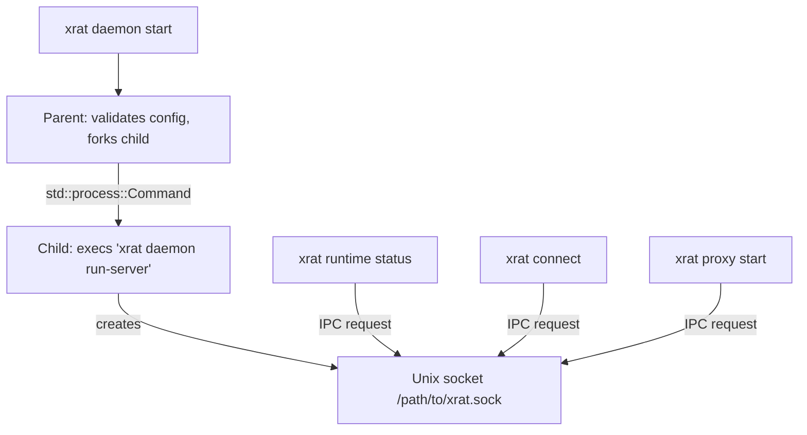
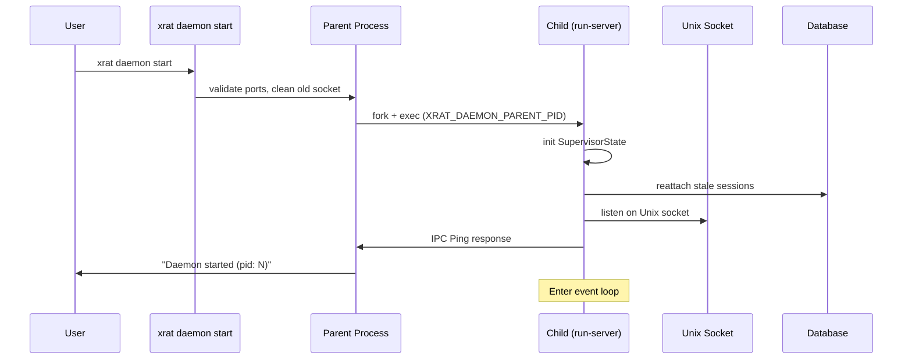
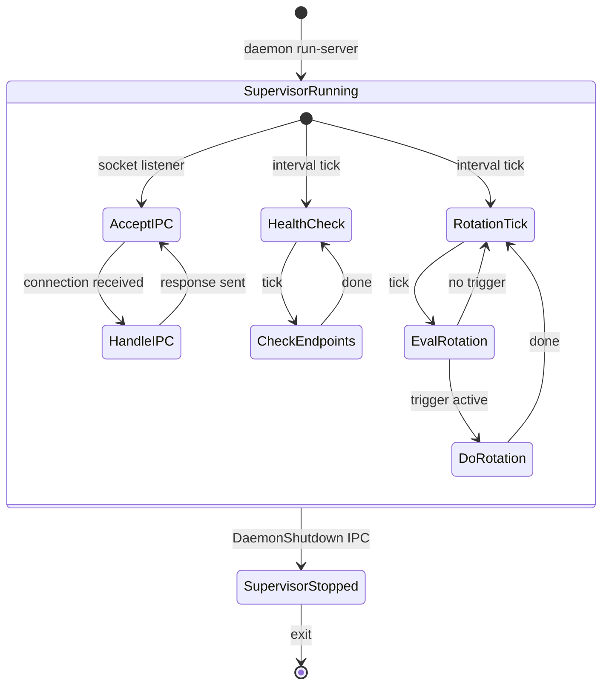
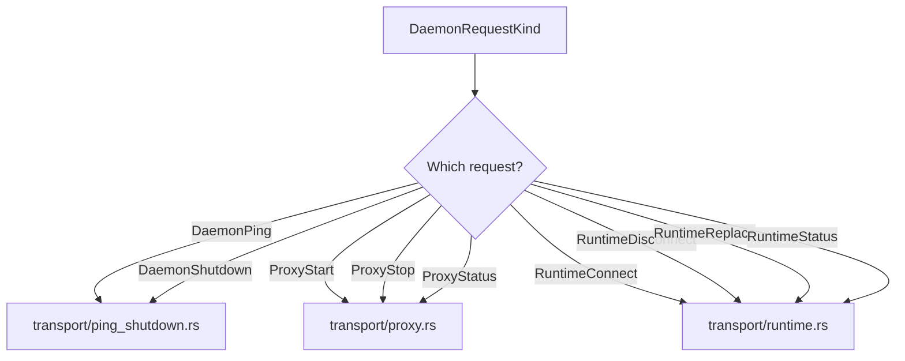
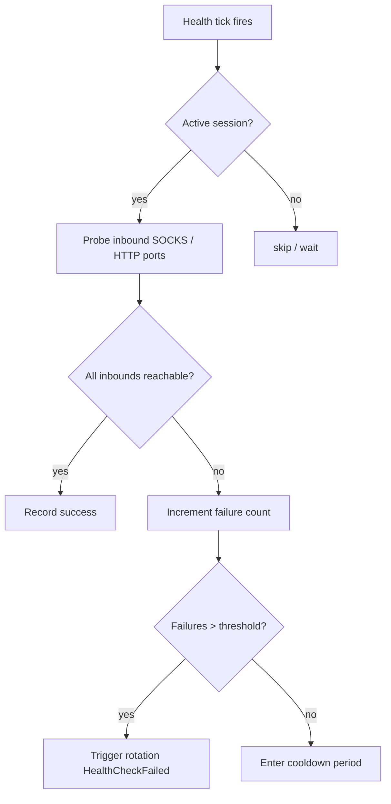
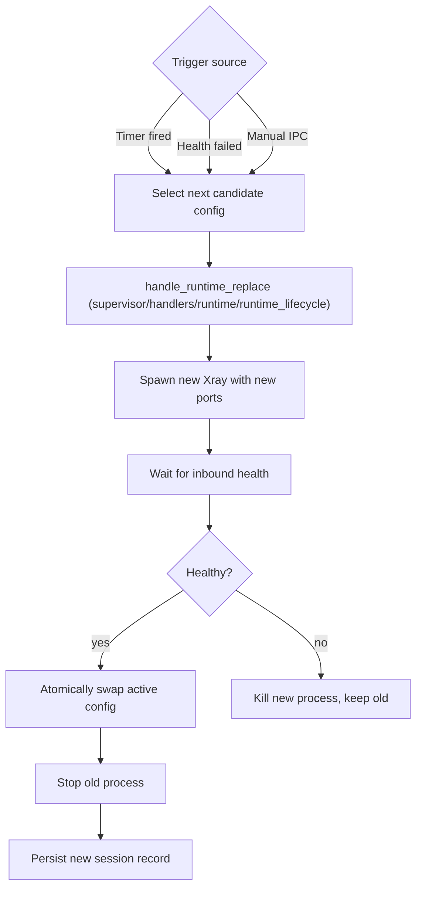

# Daemon Architecture

The daemon is a background process that owns the managed Xray runtime, accepts
IPC requests from CLI/TUI clients, runs health checks, and drives auto-rotation.

## Process Model



## Daemon Startup Sequence



## Supervisor Event Loop

The supervisor runs a `tokio::select!` loop with three concurrent branches (IPC
accept, health-check tick, rotation tick). The structure of the loop itself is
internal — what matters is the set of `SupervisorEvent` messages the loop
handles and the resulting `SupervisorState` mutations.



## IPC Protocol

The daemon communicates with CLI clients over a Unix socket using newline-
delimited JSON. The wire envelope is `DaemonRequest` / `DaemonResponse<T>` (see
`app/daemon/ipc/types.rs`); the actual operations are variants on
`DaemonRequestKind`.

### Request Envelope

```rust
pub struct DaemonRequest {
    pub protocol_version: u16,
    pub request: DaemonRequestKind,
}

pub enum DaemonRequestKind {
    DaemonPing,
    DaemonShutdown,
    RuntimeStatus,
    RuntimeConnect { config_id: i64 },
    RuntimeReplace {
        trigger: RotationTrigger,
        candidate_id: Option<i64>,
    },
    RuntimeDisconnect,
    ProxyStart,
    ProxyStatus,
    ProxyStop,
}
```

`RuntimeConnect` and `RuntimeReplace` carry the operation inputs inline; the
other variants are unit-only. `DaemonResponse<T>` is generic, wraps a
`DaemonResponseCode` (`Ok | Busy | NotFound | InvalidState | InternalError`),
and carries a typed payload (`PingPayload`, `RuntimeStatusPayload`,
`RuntimeConnectPayload`, etc.).

### Client and Server

```mermaid
sequenceDiagram
    participant C as IPC Client (CLI / TUI)
    participant S as IPC Server (Daemon)

    C->>S: connect Unix socket
    S-->>C: accept connection

    rect rgb(40, 60, 90)
        Note over C,S: One DaemonRequest / DaemonResponse exchange
    end

    C->>S: write JSON request + newline
    S->>S: parse DaemonRequest
    S->>S: dispatch_request
    S->>S: supervisor handler
    S->>S: build DaemonResponse
    S-->>C: write JSON response + newline
    C->>C: read JSON response + newline
```



### Transport Routing

`app/daemon/ipc/handler/dispatch.rs` maps every `DaemonRequestKind` variant to a
`*_response_via_supervisor` helper. Those helpers live in
`app/daemon/ipc/transport/` grouped by feature:



## Health Checking



Inbound health is reported as `RuntimeInboundHealth` with per-endpoint
`RuntimeEndpointState::{Reachable, Unreachable, NotChecked}` (see
[Runtime Lifecycle](runtime-lifecycle.md)).

## Auto-Rotation

The daemon can rotate the active proxy on three triggers:

```rust
pub enum RotationTrigger {
    Manual,
    Timer,
    HealthCheckFailed,
}
```

The trigger is carried inline in `DaemonRequestKind::RuntimeReplace`. The
supervisor stores rotation state in `SupervisorState` (per-`AppContext`) and
reports it via `ProxyStatusPayload` (`rotation_enabled`, `interval_secs`,
`health_trigger_enabled`, `cooldown_secs`, `last_trigger`, `last_result`,
`cooldown_active`, `next_timer_epoch_secs`).

### Rotation Flow


