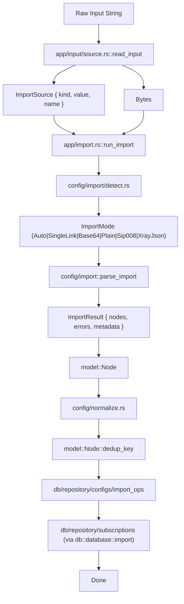
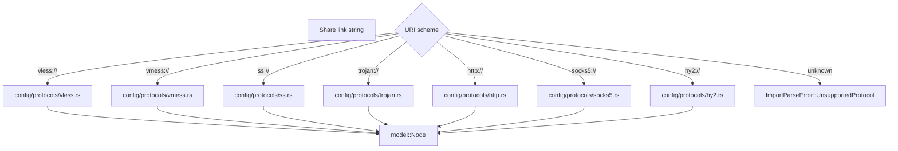

# Import Pipeline

The import pipeline converts raw input (URLs, files, raw text) into normalized
`Node` records, deduplicates them, and persists them as `ConfigRecord` rows
under their source `SubscriptionRecord`.

## End-to-End Flow



## Input Sources

`app/input/source.rs::read_input` accepts a single string and decides how to
load the bytes. There is no separate `InputSource` enum at the call site — the
function returns an `ImportSource` plus the raw bytes.

```rust
pub fn read_input(input: &str) -> Result<(ImportSource, Vec<u8>), AppError>;

pub struct ImportSource {
    pub kind: SourceKind,    // Url | File | RawText
    pub value: String,       // original input or path
    pub name: Option<String>,
}
```

Decision rules:

- `looks_like_url(input)` → fetch with `reqwest::blocking::get`; status errors
  propagate as `AppError`.
- `Path::new(input).exists()` → read from disk; filename is used as `name` when
  available.
- otherwise → treat the input as raw text bytes.

## Format Detection

`config/import/detect.rs` runs heuristics on the (decoded) bytes to pick an
`ImportMode`:

```rust
pub enum ImportMode {
    Auto,
    SingleLink,
    Base64Subscription,
    PlainList,
    Sip008Json,
    XrayJson,
}
```

| Detected as          | Heuristic                                              | Parser entry                         |
| -------------------- | ------------------------------------------------------ | ------------------------------------ |
| `SingleLink`         | Starts with a known URI scheme                         | `parsers::parse_single_link`         |
| `Sip008Json`         | JSON object with `version: 1` and `servers: [...]`     | `parsers::parse_sip008_json`         |
| `XrayJson`           | JSON object with `outbounds` (or log/inbounds)         | `parsers::parse_xray_json`           |
| `Base64Subscription` | Decodes to base64, then plain-list parses successfully | `parsers::parse_base64_subscription` |
| `PlainList`          | Newline-separated share links                          | `parsers::parse_plain_list`          |

`config/import::parse_import` is the public entry point; it takes a string plus
an `ImportMode` (use `Auto` for detection, anything else to force a mode) and
returns `ImportResult { nodes, errors, metadata }`.

## Protocol Parsers

Each supported protocol has a dedicated parser in `config/protocols/`:



The `Protocol` enum lives in `model/protocol.rs` and serializes lowercase
(`vless`, `vmess`, `ss`, `trojan`, `http`, `socks5`, `hy2`).

## Node Struct

`model::Node` is the shared, in-memory domain type produced by every parser and
consumed by every engine generator. Fields are intentionally minimal —
protocol-specific quirks live in the parser or get dropped on the floor before
persistence.

```rust
pub struct Node {
    pub protocol: Protocol,
    pub address: String,
    pub port: u16,
    pub username: Option<String>,
    pub uuid: Option<String>,
    pub password: Option<String>,
    pub method: Option<String>,   // shadowsocks cipher
    pub network: String,         // tcp | ws | grpc | ...
    pub tls: Option<String>,
    pub sni: Option<String>,
    pub host: Option<String>,
    pub path: Option<String>,
    pub name: Option<String>,
    pub extensions: Option<BTreeMap<String, String>>,
    pub raw_config: String,
}
```

Node is also the source for `NodeDedupKey` (see below).

## Normalization

`config/normalize.rs` is a single `fn normalize(node: &mut Node)` that runs in
place after parsing:

- empty `network` becomes `"tcp"`
- `network == "ws"` → copy `sni` to `host` if `host` is `None`; set `path` to
  `"/"` if `path` is `None`
- `network == "grpc"` → set `path` to `"/"` if `path` is `None`
- empty-string `tls` (`Some("")`) is collapsed to `None`

## Deduplication

`model::Node::dedup_key` returns a `NodeDedupKey`. Its `Display` impl serializes
a length-prefixed, versioned string that the DB stores in `configs.dedup_key`
(UNIQUE).

```rust
pub struct NodeDedupKey {
    pub protocol: Protocol,
    pub address: String,
    pub port: u16,
    pub username: Option<String>,
    pub uuid: Option<String>,
    pub password: Option<String>,
    pub method: Option<String>,
    pub network: String,
    pub tls: Option<String>,
    pub sni: Option<String>,
    pub host: Option<String>,
    pub path: Option<String>,
}
```

The serialized form prefixes every field with `name=<char_count>:<value>` and
writes `name=-` for `None` values, so missing and empty-string values differ.
Example:

```text
v1|protocol=5:vless|address=11:example.com|port=3:443|username=-|uuid=8:uuid|123|password=-|method=-|network=2:ws|tls=3:tls|sni=15:cdn.example.com|host=15:cdn.example.com|path=4:/ray
```

`db/repository/configs/import_ops` performs the upsert keyed on `dedup_key`;
duplicates are skipped and counted in `ImportSummary`.
