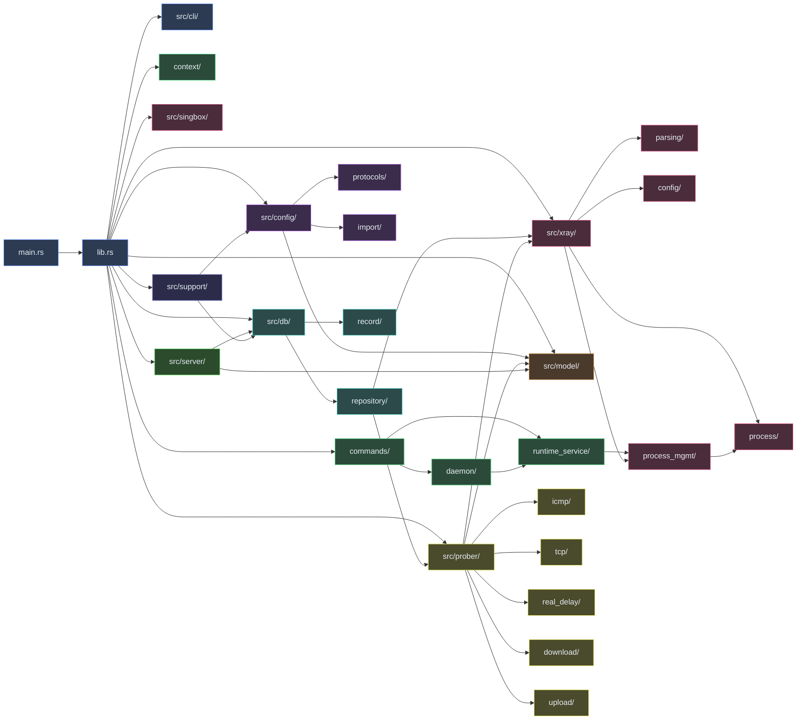
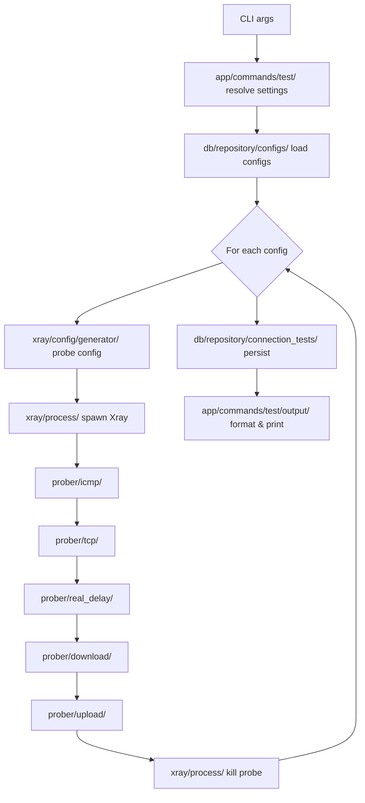
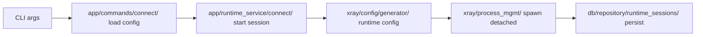
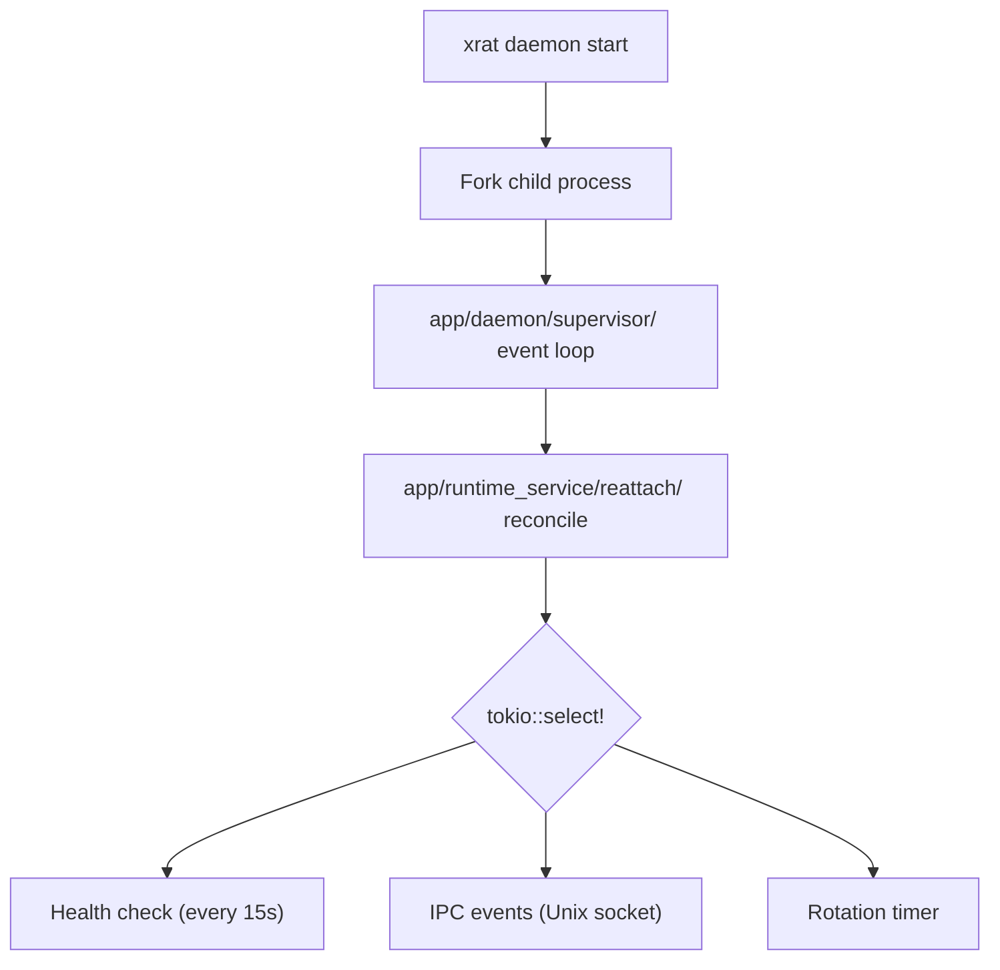
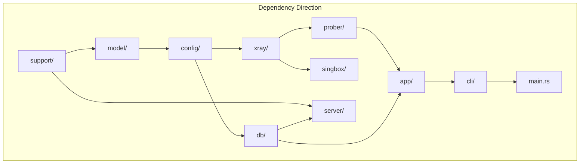

# Module Structure

xrat follows a modular architecture with clear separation of concerns across CLI
parsing, command handlers, config parsing, database access, and engine
integration.

## Component Diagram



## Module Responsibilities

| Module     | Responsibility                                                                        |
| ---------- | ------------------------------------------------------------------------------------- |
| `cli/`     | Define CLI interface with Clap. Parse args and flags. Test parsing.                   |
| `app/`     | Orchestrate command execution. Manage app lifecycle (context, config, daemon).        |
| `model/`   | Shared domain types (Node, Protocol, NodeDedupKey). No dependencies on other modules. |
| `config/`  | Parse proxy URIs. Normalize nodes. Detect import formats.                             |
| `db/`      | Database connection, migrations, queries, repositories.                               |
| `xray/`    | Generate Xray JSON configs. Parse Xray JSON. Manage Xray processes.                   |
| `singbox/` | Generate sing-box JSON configs. Manage sing-box processes.                            |
| `prober/`  | Connection testing probes: ICMP, TCP, HTTP real-delay, download, upload.              |
| `server/`  | HTTP API server using Axum. Auth, routes, response types.                             |
| `support/` | Shared utilities: base64 decode, GeoIP, network helpers.                              |

## Data Flows

### Import Flow

```mermaid
flowchart LR
    SRC[Input: URL / File / Stdin]
    APP_IN[app/input/]
    DETECT[config/import/detect]
    PARSE_FMT[config/import/parsers/]
    PROTO[config/protocols/]
    NORM[config/normalize/]
    DEDUP[model/node_dedup_key/]
    PERSIST[db/repository/configs/]
    SUB[db/repository/subscriptions/]

    SRC --> APP_IN
    APP_IN --> DETECT
    DETECT --> PARSE_FMT
    PARSE_FMT --> PROTO
    PROTO --> NORM
    NORM --> DEDUP
    DEDUP --> PERSIST
    PERSIST --> SUB
```



### Test Flow



### Connect Flow



### Daemon Flow



## Dependency Graph



## Source Tree

```
src/
├── main.rs           # Entrypoint: parse CLI, init tracing, dispatch command
├── lib.rs            # Re-exports all public modules
│
├── cli/              # Clap command/flag definitions
│   ├── mod.rs        # Module root, pub re-exports
│   ├── root.rs       # Cli struct with global flags
│   ├── command.rs    # Command enum (all subcommands)
│   ├── add.rs        # AddArgs
│   ├── connect.rs    # ConnectArgs
│   ├── daemon.rs     # DaemonArgs + DaemonAction
│   ├── disconnect.rs # DisconnectArgs
│   ├── import.rs     # ImportArgs
│   ├── lifecycle.rs  # select / enable / disable / delete / restore
│   ├── list.rs       # ListArgs + ListTarget
│   ├── parse.rs      # ParseArgs + ParseEngine
│   ├── proxy.rs      # ProxyArgs + ProxyAction
│   ├── scan.rs       # ScanArgs
│   ├── serve.rs      # ServeArgs
│   ├── status.rs     # StatusArgs
│   ├── tui.rs        # TuiArgs
│   ├── test_cmd/     # TestArgs + TestFormat/TestSortBy
│   └── tests/        # CLI parsing tests (cases/test_command, cases/runtime_parse, ...)
│
├── app/              # Application layer
│   ├── mod.rs
│   ├── app_paths.rs  # Filesystem layout resolution
│   ├── context.rs    # AppContext: DB + config + runtime paths
│   ├── context/
│   │   ├── paths.rs  # Runtime path resolution
│   │   └── tests/    # Context tests (binary, database resolution)
│   ├── config/       # AppConfig TOML deserialization (proxy + testing)
│   ├── daemon.rs     # Daemon CLI dispatch glue
│   ├── error.rs      # AppError enum
│   ├── import.rs     # Top-level import orchestration
│   ├── input/        # Input source reading (read_input, fetch_url)
│   ├── runtime_service.rs  # RuntimeService public re-exports
│   ├── commands/     # Command handlers
│   │   ├── mod.rs
│   │   ├── add.rs
│   │   ├── connect.rs
│   │   ├── daemon.rs
│   │   ├── disconnect.rs
│   │   ├── import.rs
│   │   ├── lifecycle.rs
│   │   ├── list.rs
│   │   ├── parse.rs
│   │   ├── proxy.rs
│   │   ├── runtime_output.rs
│   │   ├── scan.rs
│   │   ├── serve.rs
│   │   ├── status/   # display + json + tests submodules
│   │   ├── test.rs
│   │   ├── test/
│   │   │   ├── bulk/         # bulk executor
│   │   │   │   └── bulk_executor/
│   │   │   ├── execution/    # per-config probe loop
│   │   │   ├── handlers/     # CLI arg handling helpers
│   │   │   ├── output/       # table / TSV / CSV / JSON output
│   │   │   ├── output_types/
│   │   │   ├── settings/     # resolve / rows / validation
│   │   │   ├── stages/       # endpoint / progress / throughput
│   │   │   └── tests/        # focused tests
│   │   └── tui.rs
│   ├── runtime_service/  # Proxy process lifecycle
│   │   ├── connect/      # Connect flow
│   │   ├── replace_flow/ # Atomic disconnect + connect (candidate, ports, stage)
│   │   ├── reattach/     # Stale session recovery (process inspector)
│   │   ├── session_state/# State transitions + inbound health
│   │   ├── types.rs
│   │   └── tests/        # Integration tests
│   └── daemon/       # Daemon supervisor
│       ├── ipc/      # Unix socket IPC protocol
│       │   ├── types.rs      # Request/response types (DaemonRequest, RotationTrigger, ...)
│       │   ├── handler/      # dispatch.rs + io.rs
│       │   ├── client/       # unix_impl.rs + unsupported_impl.rs
│       │   ├── transport/    # ping_shutdown.rs, proxy.rs, runtime.rs
│       │   └── tests/        # IPC integration tests
│       └── supervisor/      # Event loop
│           ├── mod.rs
│           ├── types.rs
│           ├── health.rs
│           ├── runtime.rs
│           ├── test_support.rs
│           ├── tests.rs
│           └── handlers/    # Health check, rotation, runtime
│               ├── health.rs
│               ├── mod.rs
│               ├── runtime/         # runtime_lifecycle/, runtime_status_connect/
│               └── tests/           # tests_replace/
│
├── model/             # Shared domain types
│   ├── node.rs        # Node struct
│   ├── protocol.rs    # Protocol enum
│   └── node_dedup_key.rs  # Dedup key generation
│
├── config/            # Config parsing and normalization
│   ├── protocols/     # Protocol-specific parsers
│   │   ├── vless.rs   # vless:// parser
│   │   ├── vmess.rs   # vmess:// parser
│   │   ├── ss.rs      # ss:// parser
│   │   ├── trojan.rs  # trojan:// parser
│   │   ├── http.rs    # http:// parser
│   │   ├── socks5.rs  # socks5:// parser
│   │   ├── hy2.rs     # hysteria2:// parser
│   │   └── tests/     # Parser tests
│   ├── line.rs        # Line-by-line text parsing
│   ├── normalize.rs   # Node normalization defaults
│   ├── parse_service.rs # Engine-aware parsing
│   ├── import/        # Import format detection
│   │   ├── detect.rs  # Format detection heuristics
│   │   ├── error.rs
│   │   ├── mod.rs     # ImportMode / ImportResult / parse_import
│   │   ├── subscription.rs # URL fetch + metadata
│   │   └── parsers/   # single_link, plain_list, base64, sip008, xray
│   └── parsing_helpers.rs # Shared URI helpers
│
├── db/                # Database layer
│   ├── connection.rs  # Connection pool management
│   ├── schema.rs      # Migration runner
│   ├── error.rs       # DbError enum
│   ├── mod.rs         # DbPool + facade re-exports
│   ├── database/      # Database query methods
│   ├── repository/    # SQL implementations
│   │   ├── api/       # API-specific queries
│   │   ├── cf_scan_results.rs
│   │   ├── configs/
│   │   │   ├── import_ops/  # Upsert on dedup_key
│   │   │   ├── state_ops/   # enable/disable/select/delete
│   │   │   └── server_ops.rs
│   │   ├── connection_tests.rs
│   │   ├── row/             # Shared row helpers
│   │   └── runtime_sessions.rs
│   └── record/        # Record types (DTOs)
│       ├── cf_scan_results.rs
│       ├── configs.rs
│       ├── connection_tests.rs
│       ├── import.rs  # ImportSource, SubscriptionRecord, ...
│       ├── mod.rs
│       └── runtime_sessions.rs
│
├── xray/              # Xray-core integration
│   ├── config/        # Config generation
│   │   ├── generator/ # Probe + runtime config builders
│   │   ├── outbound.rs # Protocol-to-outbound mapping
│   │   ├── stream.rs  # Stream settings (TLS, WS, gRPC, TCP)
│   │   └── types.rs   # XrayConfig, Inbound, Outbound structs
│   ├── parsing/       # Xray JSON config parsing
│   │   ├── core/      # Top-level config structure
│   │   ├── protocols/ # Inbound/outbound protocol parsers
│   │   │   ├── inbound_settings/
│   │   │   └── outbound_settings/
│   │   ├── transports/ # Transport settings parsers
│   │   │   └── security/
│   │   └── shared/    # Shared types (enums, strings)
│   ├── process/       # Low-level process spawn + lifecycle
│   │   ├── errors.rs
│   │   ├── spawn.rs
│   │   └── tests.rs
│   └── process_mgmt/  # High-level process management + signals
│       ├── mod.rs
│       ├── process.rs
│       ├── signals.rs
│       └── tests.rs
│
├── singbox/           # sing-box integration
│   ├── mod.rs
│   └── config/        # sing-box config generation + process_mgmt helper
│       ├── mod.rs
│       └── process_mgmt.rs
│
├── prober/            # Connection testing probes
│   ├── mod.rs         # FailureKind + combined TestResult
│   ├── icmp/          # ICMP ping (parse system ping output)
│   │   ├── mod.rs     # icmp_ping, ping_with_system_command
│   │   ├── parsing.rs # parse_ping_latency, classify_ping_failure
│   │   └── tests.rs
│   ├── tcp/           # TCP connectivity check + failure classification
│   │   ├── check.rs   # tcp_check
│   │   ├── classify.rs
│   │   ├── errors.rs
│   │   ├── model.rs   # TcpResult
│   │   ├── mod.rs
│   │   └── tests.rs
│   ├── real_delay/    # HTTP round-trip latency via proxy
│   │   ├── check/     # execute, model, port, request, mod
│   │   ├── classify.rs
│   │   └── mod.rs
│   ├── download/      # Download speed measurement
│   │   ├── check/     # proxied, result, mod
│   │   ├── classify.rs
│   │   └── mod.rs
│   └── upload/        # Upload speed measurement
│       ├── classify.rs
│       ├── mod.rs
│       └── request.rs
│
├── server/            # Axum HTTP API
│   ├── mod.rs
│   ├── routes/        # b64, configs, health, json
│   ├── auth.rs        # API key authentication
│   ├── response.rs    # Response types
│   ├── state.rs       # ServerState
│   └── error.rs       # Server error types
│
├── tui/               # Ratatui TUI
│   ├── mod.rs
│   ├── run.rs         # Terminal lifecycle + main loop
│   ├── keymap.rs
│   ├── task.rs        # Background task primitives
│   ├── theme.rs
│   ├── app/           # App state, reducers, navigation
│   ├── data/          # Data loading + tests
│   └── view/          # chrome, configs, sources, runtime, tests, modals
│
└── support/           # Shared utilities
    ├── decode.rs      # Base64 decoding
    ├── geoip.rs       # MaxMind GeoIP lookups
    ├── net.rs         # Network utilities
    ├── time.rs        # Timestamp helpers
    └── url.rs         # URL detection helpers
```

## File Conventions

- **`mod.rs`**: Module root, pub re-exports
- **Names**: Snake_case for files/modules, PascalCase for types, snake_case for
  functions
- **Tests**: `#[cfg(test)] mod tests { ... }` in same file or `tests/` submodule
- **Records/DTOs**: In `db/record/` — thin structs matching DB rows
- **Repository**: In `db/repository/` — SQL query functions separated by entity
