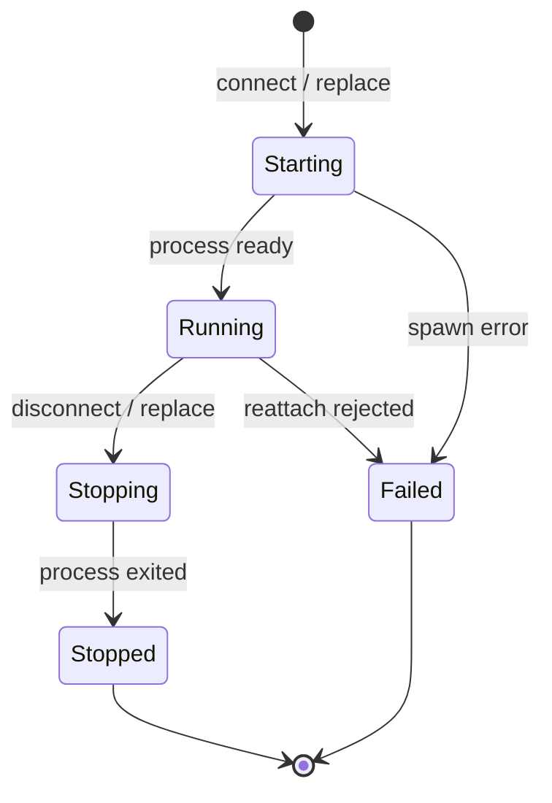
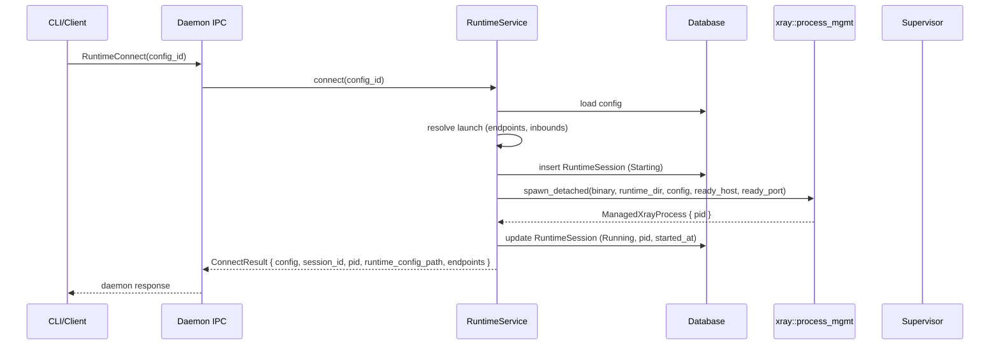
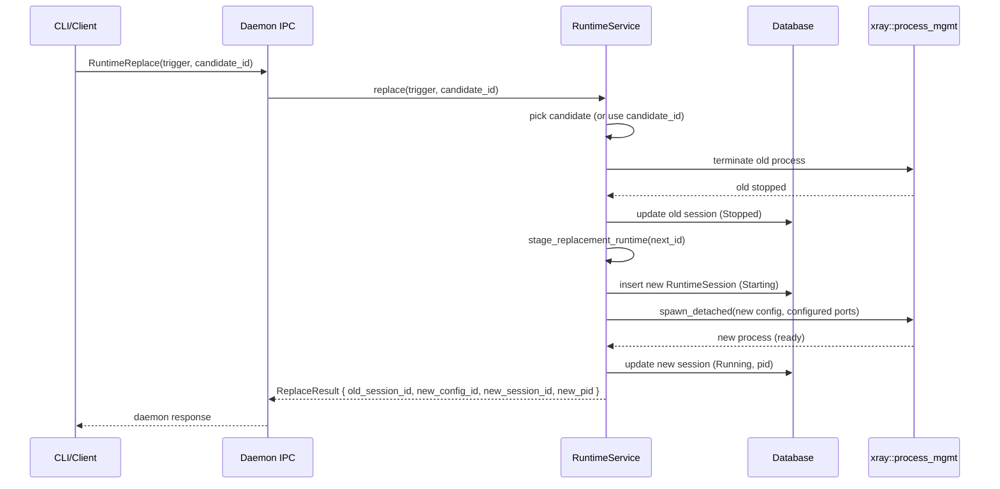
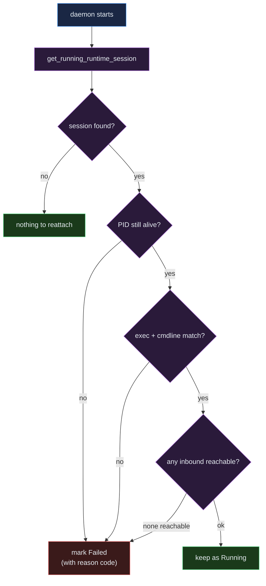

# Runtime Lifecycle

The runtime service owns the lifecycle of the managed Xray process: spawning
sessions, swapping active configs, recovering state across daemon restarts, and
reporting inbound health to clients.

The implementation lives in `app/runtime_service/`. The `RuntimeService` struct
is created from an `AppContext` and is consumed by the daemon supervisor, the
daemon IPC handlers, and TUI runtime flows. CLI runtime commands send IPC
requests to the daemon instead of constructing `RuntimeService` directly.

## RuntimeService API

```rust
pub struct RuntimeService<'a> {
    context: &'a AppContext,
}

impl RuntimeService<'_> {
    pub async fn connect(&self, config_id: i64) -> Result<ConnectResult>;
    pub async fn disconnect(&self) -> Result<DisconnectResult>;
    pub async fn status(&self) -> Result<RuntimeStatusSnapshot>;
    pub(super) async fn stage_replacement_runtime(
        &self,
        next_config_id: i64,
    ) -> Result<(i64, i64, u32)>;  // (config_id, session_id, pid)
    pub async fn reconcile_reattach_on_daemon_start(
        &self,
        daemon_instance_id: &str,
    ) -> Result<()>;
}
```

`ConnectResult` and `ReplaceResult` carry the new session id and pid;
`RuntimeStatusSnapshot` is the read-only view returned to the daemon supervisor
and the TUI.

## Persisted Session Status

Sessions in the `runtime_sessions` table carry a `RuntimeSessionStatus` with
five plain variants (no data attached). All other "states" reported to clients
are derived in memory at read time.

```rust
pub enum RuntimeSessionStatus {
    Starting,
    Running,
    Stopping,
    Stopped,
    Failed,
}
```

`as_str()` returns the snake-case string stored in the DB column.



## Derived Runtime Display

The status snapshot folds in PID liveness and inbound reachability, so the
caller can show "degraded" without separately checking the supervisor:

```rust
pub struct RuntimeStatusSnapshot {
    pub status: RuntimeSessionDisplay,
    pub session: Option<RuntimeSessionRecord>,
    pub session_config: Option<ConfigRecord>,
    pub active_config: Option<ConfigRecord>,
    pub pid_running: bool,
    pub inbound_health: RuntimeInboundHealth,
    pub database_label: String,
}

pub enum RuntimeSessionDisplay {
    Degraded,
    Persisted(RuntimeSessionStatus),
    Stale,
    StaleReconciled,
    Stopped,
}
```

`ActiveSessionState` is the internal pre-fold form used by the supervisor:

```rust
pub enum ActiveSessionState {
    None,
    Running(RuntimeSessionRecord),
    Stale(RuntimeSessionRecord),
}
```

## Connect Flow



## Replace Flow (Rotation)

The replace flow preserves the configured local inbound ports. The old process
is stopped before the replacement is launched so clients can keep using the same
SOCKS, HTTP, or Shadowsocks address after rotation.



If the replacement fails to start after the old runtime has stopped, the active
config is cleared and the failed replacement session records the startup error.

This eliminates the per-replace port rotation bookkeeping the previous design
required.

## Reattach Flow

On daemon restart the supervisor asks the runtime service whether the previously
persisted `Running` session is still alive. If the recorded PID no longer
matches an Xray executable, or the inbound is not reachable, the session is
marked `Failed` with a precise reason code.



Reject reason codes:

- `daemon_restart_reattach_rejected_pid_missing` — the recorded PID has exited.
- `daemon_restart_reattach_rejected_exec_mismatch` — the process is running but
  the executable path does not match.
- `daemon_restart_reattach_rejected_cmdline_mismatch` — the executable matches
  but the cmdline does not reference the right runtime config.

The transition is also recorded in `runtime_sessions.owner_kind`,
`owner_instance_id`, and `last_transition_*` columns so the next daemon instance
can see who rejected the session and why.

## Inbound Health Check

Inbound reachability is folded into `RuntimeStatusSnapshot.inbound_health` as a
per-endpoint view:

```rust
pub struct RuntimeInboundHealth {
    pub socks: Option<RuntimeEndpointHealth>,
    pub http: Option<RuntimeEndpointHealth>,
    pub shadowsocks: Option<RuntimeEndpointHealth>,
}

pub enum RuntimeEndpointState {
    Reachable,
    Unreachable,
    NotChecked,
}
```

`NotChecked` is returned when the recorded PID is no longer alive — the service
refuses to TCP-probe a port it knows is bound to a dead process. A session that
is `Running` with at least one `Unreachable` endpoint displays as `Degraded`.
