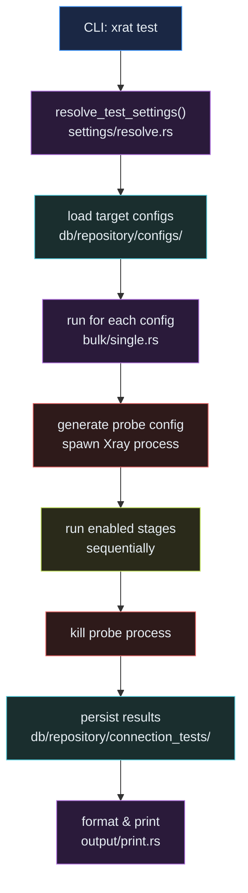
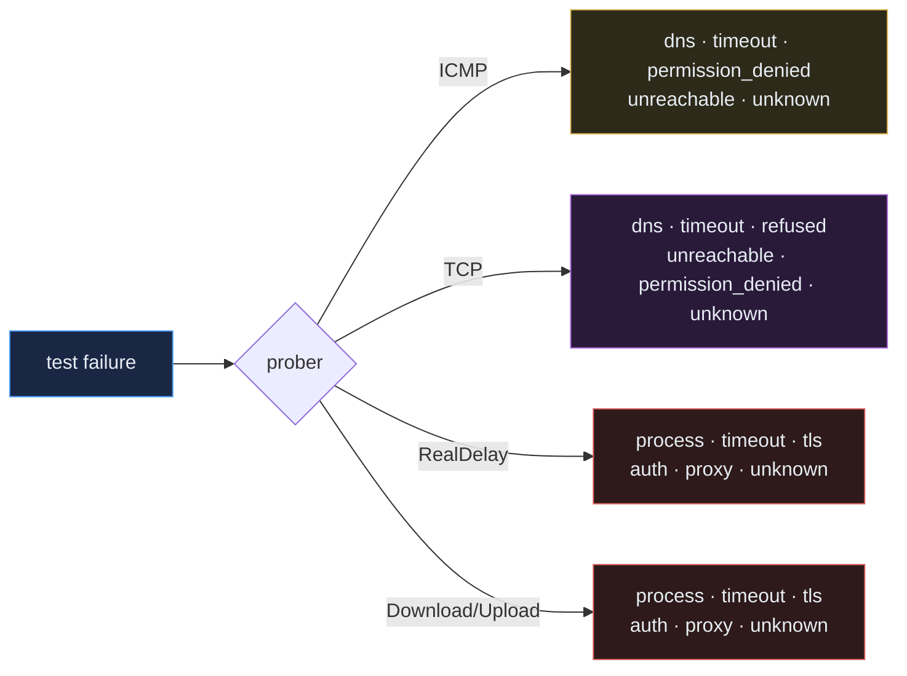
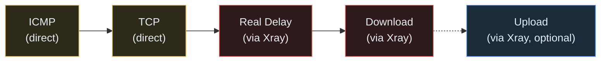

# Test Pipeline

The test command probes each selected config across one or more stages (ICMP,
TCP, real-delay, download, upload) and persists a per-config `connection_tests`
row plus a `connection_test_runs` row that groups the batch.

## High-Level Flow



## Probers

`src/prober/` is the leaf-level measurement crate. Each prober is a small async
function that returns a `*Result` struct plus a `FailureKind` on failure. The
combined `TestResult` is the only thing the rest of the command touches.

```rust
pub use download::{DownloadResult, download_speed_check};
pub use icmp::{IcmpResult, icmp_ping};
pub use real_delay::{RealDelayResult, real_delay_check};
pub use tcp::{TcpResult, tcp_check};
pub use upload::{UploadResult, upload_speed_check};

pub struct TestResult {
    pub icmp_ok: bool,
    pub icmp_ms: Option<u32>,
    pub tcp_ok: bool,
    pub tcp_ms: Option<u32>,
    pub real_delay_ok: bool,
    pub real_delay_ms: Option<u32>,
    pub download_ok: bool,
    pub download_mbps: Option<f64>,
    pub upload_ok: bool,
    pub upload_mbps: Option<f64>,
    pub ttfb_ms: Option<u32>,
    pub http_status: Option<u16>,
    pub dial_endpoint_ip: Option<String>,
    pub dial_endpoint_location: Option<String>,
    pub dial_endpoint_country: Option<String>,
    pub dial_endpoint_asn: Option<String>,
    pub dial_endpoint_geoip_source: Option<String>,
    pub dial_endpoint_fronting: Option<String>,
    pub failure_kind: Option<FailureKind>,
    pub failure_reason: Option<String>,
}
```

### Prober Source Layout

```text
src/prober/
├── icmp/
│   ├── mod.rs          — icmp_ping, ping_with_system_command
│   └── parsing.rs      — parse_ping_latency, classify_ping_failure
├── tcp/
│   ├── check.rs        — tcp_check
│   ├── classify.rs     — classify_dns_error, classify_tcp_error
│   ├── model.rs        — TcpResult
│   ├── mod.rs
│   ├── errors.rs
│   └── tests.rs
├── real_delay/
│   ├── check/
│   │   ├── execute.rs  — proxied HTTP latency through Xray
│   │   ├── model.rs    — RealDelayResult
│   │   ├── mod.rs
│   │   ├── port.rs     — inbound port detection
│   │   └── request.rs  — request execution
│   ├── classify.rs
│   └── mod.rs
├── download/
│   ├── check/
│   │   ├── proxied.rs  — proxied download
│   │   ├── result.rs   — throughput calculation
│   │   └── mod.rs
│   ├── classify.rs
│   └── mod.rs
└── upload/
    ├── classify.rs     — classify_request_error, classify_xray_error
    ├── mod.rs          — upload_speed_check
    └── request.rs      — make_proxied_upload
```

ICMP, TCP, and upload keep their logic in a single module + flat
classify/parsing files; `real_delay` and `download` push the proxied network
code one level deeper into `check/`.

## Settings Resolution

The persisted `TestingSettings` (in `app/config/testing/types.rs`) is the
"config file + defaults" form. `settings/resolve.rs::resolve_test_settings`
merges that with the CLI flags into a `ResolvedTestSettings` value that the
executor consumes.

```rust
pub struct TestingSettings {
    pub concurrency: i32,
    pub order: Vec<ConnectionTestStage>,
    pub failure_policy: TestFailurePolicy,
    pub real_delay: RealDelayTestSettings,
    pub icmp: IcmpTestSettings,
    pub download: DownloadTestSettings,
    pub tcp: TcpTestSettings,
    pub geoip: GeoIpTestSettings,
}

pub enum ConnectionTestStage {
    Icmp,
    RealDelay,
    Download,
}

pub enum TestFailurePolicy {
    Continue,
    SkipRemaining,
    MarkFailed,
}
```

`TestFailurePolicy::halts_after_failure()` returns `true` for `SkipRemaining`
and `MarkFailed`; the executor uses this to decide whether to keep going after a
stage failure.

### Resolved Settings

```rust
pub(crate) struct ResolvedTestSettings {
    pub(crate) stage_order: Vec<ConnectionTestStage>,
    pub(crate) failure_policy: TestFailurePolicy,
    pub(crate) real_delay_url: String,
    pub(crate) download_url: String,
    pub(crate) upload_url: Option<String>,         // upload only runs if Some
    pub(crate) xray_binary_path: PathBuf,
    pub(crate) icmp_timeout: Duration,
    pub(crate) tcp_timeout: Duration,
    pub(crate) xray_startup_timeout: Duration,
    pub(crate) real_delay_timeout: Duration,
    pub(crate) download_timeout: Duration,
    pub(crate) upload_timeout: Duration,
    pub(crate) upload_payload_bytes: usize,
    pub(crate) run_icmp: bool,
    pub(crate) run_tcp: bool,
    pub(crate) run_real_delay: bool,
    pub(crate) run_download: bool,
    pub(crate) run_upload: bool,
    pub(crate) concurrency: i32,
    pub(crate) geoip_enabled: bool,
    pub(crate) geoip_country_path: PathBuf,
    pub(crate) geoip_city_path: PathBuf,
    pub(crate) geoip_asn_path: PathBuf,
}
```

Note: `upload_url` is `Option<String>` and the upload stage is skipped when it
is `None` — `ConnectionTestStage` itself has no `Upload` variant.

## Failure Classification

```rust
pub enum FailureKind {
    Dns,
    Timeout,
    Refused,
    Unreachable,
    PermissionDenied,
    Tls,
    Auth,
    Process,
    Proxy,
    Unknown,
}
```

`as_str()` is the canonical snake-case form stored in
`connection_tests.failure_kind`. Classifiers live next to each prober
(`icmp/parsing.rs::classify_ping_failure`,
`tcp/classify.rs::classify_dns_error/classify_tcp_error`,
`upload/classify.rs::classify_request_error/classify_xray_error`).



## Stage Execution

Per config, the executor walks `stage_order` and runs the matching `run_*_stage`
function (`stages/throughput.rs` etc.) into a single `TestResult`. ICMP and TCP
run without spinning up Xray; real-delay, download, and upload each generate a
probe config and spawn a short-lived Xray process via
`xray::XrayProcess::spawn_with_binary`.



Stages marked **(direct)** probe the remote endpoint without a proxy process.
Stages marked **(via Xray)** spawn a short-lived Xray probe instance on a random
local port. Upload runs only when `upload_url` is configured.

## Persistence

`db/repository/connection_tests/` writes one row per config with the fields in
`ConnectionTestRecord`, and `connection_test_runs` records the batch metadata
(kind, created_at). The bulk executor groups results into a single run id so
callers can paginate by batch.

## Output Formatting

`output/print.rs` and `output/format.rs` produce the per-row and tabular output
for the CLI. The TUI reuses the same in-process executors through
`app::commands::test::bulk::*` and does not shell out to a child `xrat test`
process.
